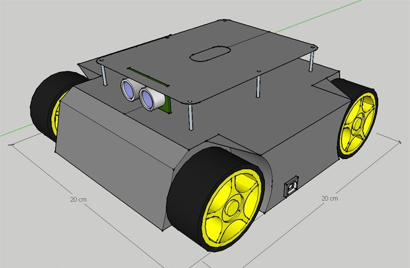

# arduino-sumo-robot
The following files contain the code of my 2020 sumo-robot. Its components include an Arduino Uno 3, two HC-SR04 ultrasonic sensors, two TCS3200 color sensors, and an L298N motor controller.
You will also find pictures of its CAD shell and an internal layout of the robot's components. 

  
Pictures of CAD design and competition day

  
  
  

The robot did not perform as well as I had hoped as it lacked weight. Nevertheless, this was an exciting project to tackle amidst the pandemic. 